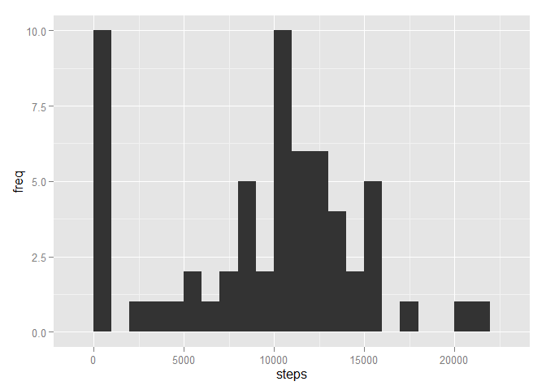
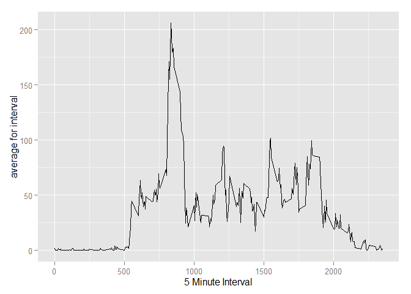
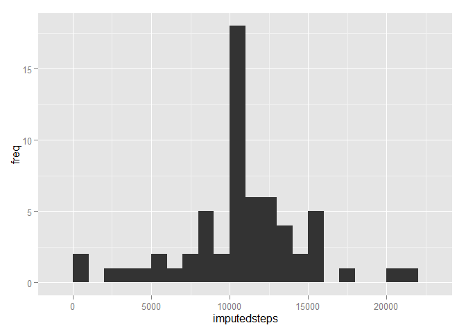
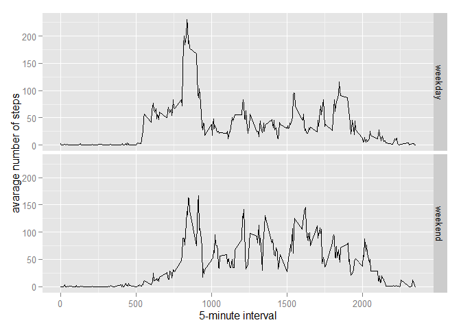

## Loading and preprocessing the data

```r
library(ggplot2)
```

```
## Warning: package 'ggplot2' was built under R version 3.2.1
```

```r
unzip(zipfile="activity.zip")
activity_data <- read.csv("activity.csv")
```

## What is mean total number of steps taken per day?

```r
totalsteps_per_day <- tapply(activity_data$steps, activity_data$date, sum, na.rm=T)
totalsteps_per_day <- totalsteps_per_day[!is.na(totalsteps_per_day)]
```
Plotting histogram:

```r
qplot(totalsteps_per_day, xlab="steps", ylab="freq", binwidth=1000)
```

 
Mean and median total steps taken per day is :

```r
mean_step = mean(totalsteps_per_day)
median_step = median(totalsteps_per_day)
mean_step
```

```
## [1] 9354.23
```

```r
median_step
```

```
## [1] 10395
```

## What is the average daily activity pattern?

```r
activity_avgfiveint <- tapply(activity_data$steps, activity_data$interval, mean, na.rm=T)
qplot(as.numeric(labels(activity_avgfiveint)[[1]]),as.numeric(activity_avgfiveint), xlab="5 Minute Interval", ylab="average for interval", geom = "path")
```

 

```r
activity_sumfiveint <- tapply(activity_data$steps, activity_data$interval, sum, na.rm=T)
sumofinterval_array <- as.data.frame(cbind(as.numeric(labels(activity_sumfiveint)[[1]]),as.numeric(activity_sumfiveint)))
colnames(sumofinterval_array)<- c("interval", "sum")
max_interval <- sumofinterval_array[which.max(sumofinterval_array$sum),]$interval
```
The 5 minute interval at ```{r} max_interval``` contains the greatest number of steps on average.

## Imputing missing values

```r
number_NA <- dim(activity_data[is.na(activity_data$steps),])[1]
imputed_activity_data <- activity_data
avgofinterval_array <- as.data.frame(cbind(as.numeric(labels(activity_avgfiveint)[[1]]),as.numeric(activity_avgfiveint)))
colnames(avgofinterval_array)<- c("interval", "avg")
for (i in 1:dim(imputed_activity_data)[1]) {
    if(is.na(imputed_activity_data[i ,]$steps)){
        interval_chosen <- imputed_activity_data[i,]$interval
        replace_value <- (avgofinterval_array[avgofinterval_array$interval==interval_chosen,]$avg)
        imputed_activity_data[i ,]$steps <- replace_value
    }
}

imputed_totalperday <- tapply(imputed_activity_data$steps, imputed_activity_data$date, sum)
qplot(imputed_totalperday, xlab="imputedsteps", ylab="freq", binwidth=1000)
```

 

```r
mean_imputed = mean(imputed_totalperday)
median_imputed = median(imputed_totalperday)
```
The total number of missing values is ```{r} number_NA```
Using a for loop, i impute the mean value for the interval and then plot imputed values' histogram.
New mean and median are ```{r} mean_imputed; median_imputed```


## Are there differences in activity patterns between weekdays and weekends?

```r
activity_data$weekday <- weekdays( as.Date(activity_data$date) )
weekends <- (activity_data$weekday == 'Saturday' | activity_data$weekday == 'Sunday')
imputed_activity_data$weektime <- 'weekend'
imputed_activity_data[!weekends,]$weektime <- 'weekday'
imputed_activity_data$weektime <- as.factor(imputed_activity_data$weektime)
avg_imputed_data <- aggregate(steps ~ interval + weektime, data=imputed_activity_data, mean)
ggplot(avg_imputed_data, aes(interval, steps)) + 
    geom_line() + 
    facet_grid(weektime ~ .) +
    xlab("5-minute interval") + 
    ylab("avarage number of steps")
```

 
